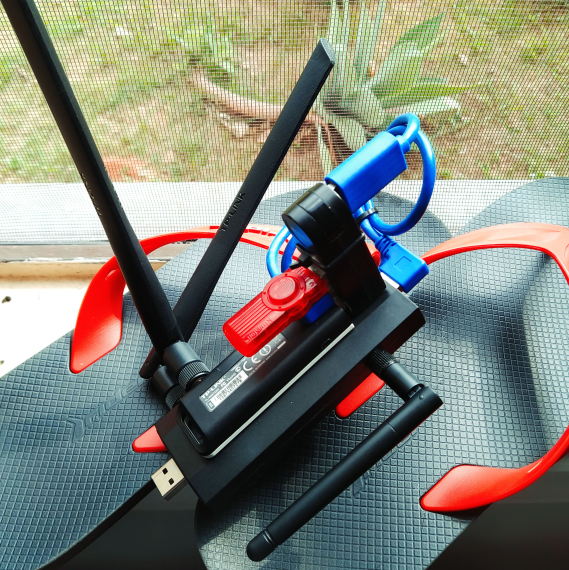

# ChineloDriving
A project repository to store documented experimentation on warwalking subject and look alikes, with affordable or popular hardware, code skills, creativity, open source tooling and friendship.

## Chinelo is a flip-flops

So it's like a wardriving, but with flip-flops - thus ChineloDriving.

Pineapple on flip-flops | Pwnagotchi on flip-flops 
--- | --- 
|

## Hey!

That repository is just a notepad, and nothing more. Notepads can only be read or write on. I can't be responsible for your use of notepads beyond it's very purpose: taking notes.
